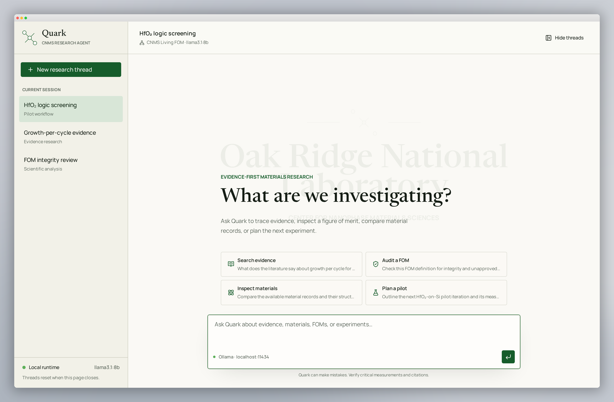

# Quark — CNMS Living FOM Research Agent

Quark is the conversational front end for the **CNMS Living FOM** project: a
materials-research assistant that answers from evidence, flags data gaps, and
never invents measurements or citations. The interface is built as a calm
research workspace — a thread rail, a focused conversation, and a composer
wired to a **local Ollama model**.

This repository is the UI. The science lives in
[`zackwoodel-debug/cnms-living-fom`](https://github.com/zackwoodel-debug/cnms-living-fom)
(backend, database, migrations, docs).



## What it does

- **Threaded research sessions** — a left rail of research threads, each with
  its own conversation; the active thread is part of the URL
  (`/chat/hf02-screening`).
- **Streaming answers from a local model** — every reply is streamed token by
  token from Ollama on your own machine. Nothing leaves the laptop.
- **Stop control** — generation can be interrupted mid-answer.
- **Evidence-first persona** — Quark separates evidence from inference, calls
  out data gaps, and refuses to invent measurements or citations.
- **Materials-research starters** — one-tap prompts for searching evidence,
  auditing a figure of merit, comparing material records, and planning a pilot.
- **Honest status** — the composer shows the live runtime (`Ollama ·
  localhost:11434`) and the model in use; provider failures appear in the chat
  instead of being disguised as an answer.
- **ORNL / CNMS watermark** — the Oak Ridge National Laboratory, Center for
  Nanophase Materials Sciences lockup sits behind the empty conversation.

## Quick start


```sh
npm i            # or: bun install
npm run dev      # http://localhost:8080
```

`/` redirects to `/chat/hf02-screening`.

## Requirements

- Node.js 20+ (or Bun) for the dev server and build.
- [Ollama](https://ollama.com) running locally on `http://localhost:11434`.
- The model pulled and warm:

```sh
ollama pull llama3.1:8b
```

### Allowing the browser to reach Ollama

Quark calls Ollama straight from the browser, so the runtime must accept the
app's origin. If you see **"Ollama is unavailable…"**, start Ollama with the
origin allowed and reload:

```sh
OLLAMA_ORIGINS=http://localhost:8080 ollama serve
```

## Configuration

All model wiring is in one file, [`src/lib/ollama.ts`](src/lib/ollama.ts):

| Setting | Value | Notes |
| --- | --- | --- |
| `OLLAMA_URL` | `http://localhost:11434/api/chat` | Point elsewhere for a remote or containerised runtime. |
| `OLLAMA_MODEL` | `llama3.1:8b` | Any pulled tag works, e.g. `qwen2.5:14b`. |
| System prompt | in `streamOllamaChat` | Sets the evidence-first CNMS persona. |

To use a different model, change `OLLAMA_MODEL` and restart the dev server.

## How the chat works

1. `PromptInput` submits the message and the full history of the active thread.
2. `streamOllamaChat` posts to `/api/chat` with `stream: true`, reads the
   newline-delimited JSON body, and pushes each `message.content` token into the
   assistant message as it arrives.
3. The submit button switches to a stop control; aborting closes the stream and
   keeps everything already received.
4. Provider errors (unreachable runtime, model missing, non-`2xx`, empty stream)
   surface in the chat instead of failing silently.

## Project layout

```text
src/
  components/
    quark-workspace.tsx   # thread rail, conversation, starters, composer
    quark-mark.tsx        # Quark identity mark (atomic lattice motif)
    ai-elements/          # conversation, message, prompt-input, shimmer
    ui/                   # shadcn primitives
  lib/
    ollama.ts             # streaming client + model config
  routes/
    __root.tsx            # document head, fonts, metadata
    index.tsx             # "/" → "/chat/hf02-screening"
    chat.$threadId.tsx    # renders the workspace for a thread
  styles.css              # design tokens (colour, type, spacing, motion)
```

## Design system

Scientific-editorial direction: warm laboratory white, graphite text, an
ORNL-inspired green primary, restrained amber for status, crisp dividers,
compact controls, minimal rounding.

- **Type**: Manrope (interface), Newsreader (assistant responses), DM Mono
  (metadata and code) — loaded from the document head.
- **Tokens**: colour, surfaces, status, shadow, and radius live in
  `src/styles.css`; components consume semantic tokens only, so dark/light
  surfaces stay consistent.
- **Motion**: subtle, and disabled under `prefers-reduced-motion`.

## Current limitations

- **Threads are session-only.** They live in memory and reset when the tab
  closes; nothing is persisted.
- **No account system.** One local user, one local model.
- The assistant answers from the model's own knowledge. Retrieval against the
  CNMS Living FOM database and evidence store is not wired yet.

## Scripts

```sh
npm run dev        # local dev server
npm run build      # production build
npm run preview    # serve the build
npm run lint       # eslint
npm run format     # prettier
```

## Built with

TanStack Start (React 19, Vite), Tailwind CSS v4, shadcn/ui, AI Elements
(Streamdown responses), Ollama.
